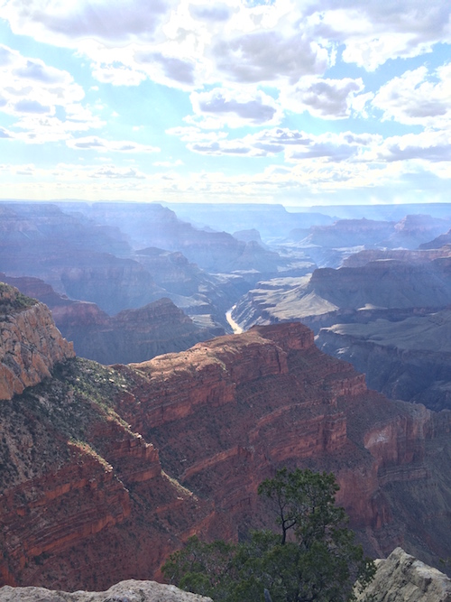
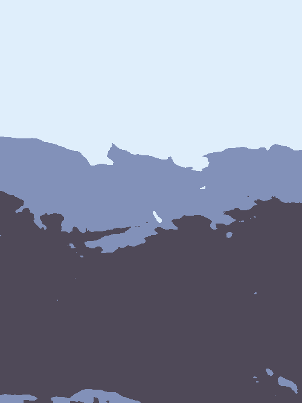
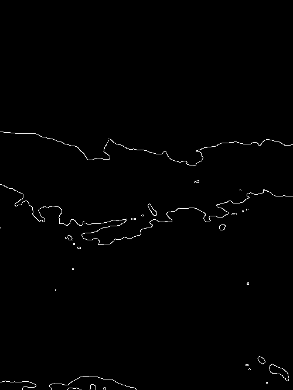
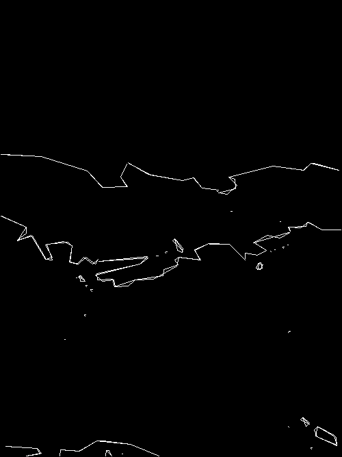
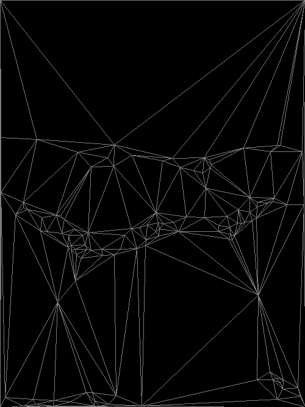
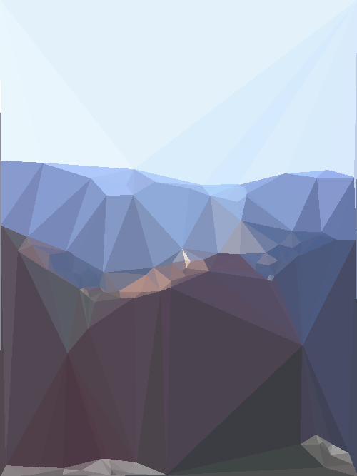

# Geometrip

## Usage
`./main.py -f INPUT_FILE -o OUTPUT_FOLDER`

## Example

### This will be our input image:

### The image is first blurred:

### Then the colors are clustered:

### A canny filter is applied:

### And contours are drawn over the image:

### Then a triangle mesh is drawn from the contours:

### And the geometry is colored based on the input:

